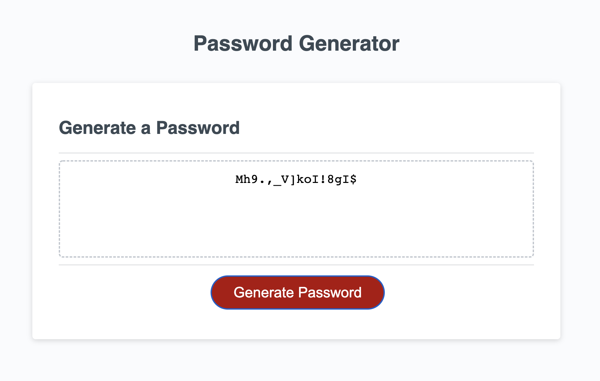
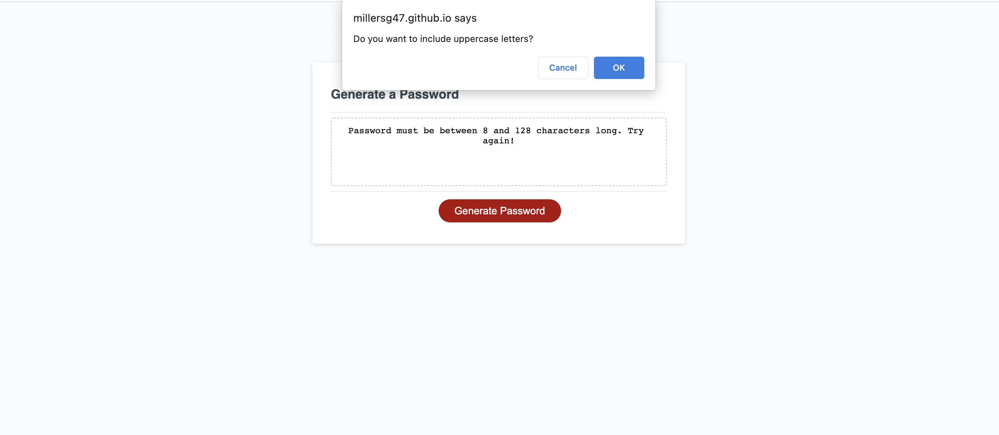

# PASSWORD-GENERATOR

## PROJECT OVERVIEW
This webpage is a random password generator. It asks the user how many characters they want included in the password, then it asks them which character types they want included, lastly, it generates a password to fit their requirements. 

The webage is linked [here](https://millersg47.github.io/password-generator/).

## TECHNOLOGIES USED
HTML, CSS, Javascript

## INSTALLATION
Install the app locally by cloming the git repo and use a text editor to manipulate the code. 

## CONFIGURATION
The application has no menu or modifiable settings. There is no configuration required.

## USAGE
Use the application to generate passwords that are between 8 and 128 characters long and can include lowercase and uppercase letters, numbers and special characters. 

## CREDITS
No other contributors are involved in the project. 

## LICENSE
MIT license applied in LICENSE.txt file.

## CONTACT
Sophie Miller, millersg47@gmail.com
